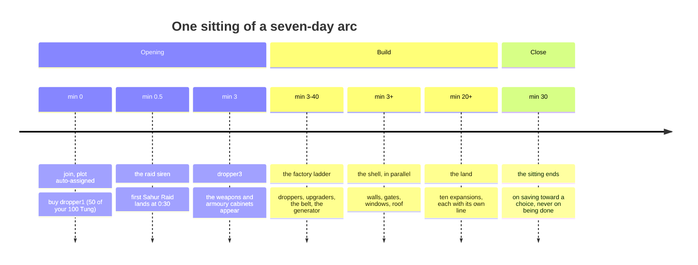
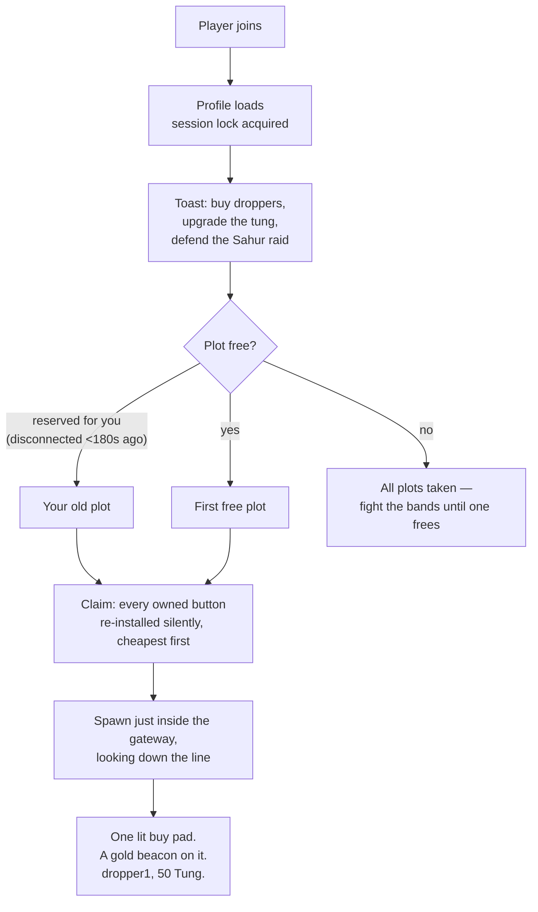
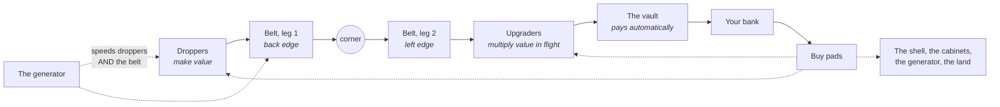
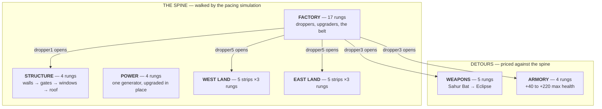
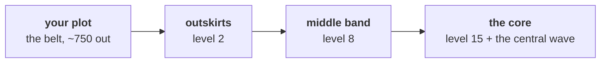
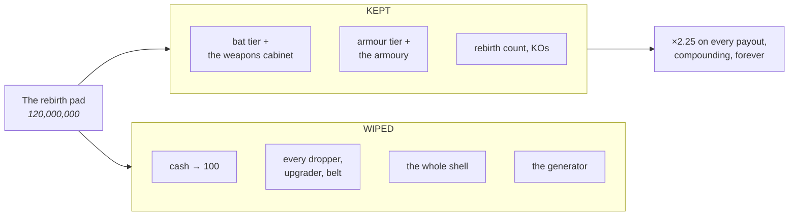

# Tung Tung Tycoon — the game, as it stands today

> **Your factory gets raided, and you fight them off with a bat.**

> [!IMPORTANT]
> **This describes what ships today. It is not the target.**
>
> The game is being reshaped around a seven-day arc: a sitting delivers a floor,
> rebirth works like a Clash of Clans Town Hall, and the world opens up. That
> direction lives in [#72](https://github.com/adit-rah/ttt/issues/72) and its
> five pillars. This file catches up as the code does.
>
> The largest gaps between the two: the build below is **53 minutes**, floors do
> not generalize past one, and waves are server-wide.

This is the **as-is** description: what the shipped game does, in the player's
terms, with the numbers it actually runs on. Where something is unresolved it
says so and points at the issue.

Every number here is read out of `src/shared/Config.lua`, and every pacing
figure out of the economy simulation in `tools/verify_config.lua` (last
committed run recorded in `../dev/HANDOFF_v10.md` §2).

**Audience:** Roblox, where 80% of sessions are on a phone and 56% of users are
under 16 (`research/GROWTH.md` §6). Every decision below that mentions "reads
at a glance" or "the thumb" is downstream of that one fact.

**Not monetized.** A deliberate decision, held open for now — see `D-01`.

---

## 1. The shape of a session



**The target is a WEEK** (#90): sittings of about thirty minutes, offline
gaps paying the vault's discounted rate through the storage cap, and two or
three rebirths on the way to a frontier. The verifier walks the whole arc —
sitting, gap, sitting — and the measured week lands the frontier on **day 5**
through **3 rebirths**, the first on **day 3**, with no purchase taking more
than one sitting of pure saving. One life is 260-odd active minutes at
rebirth-zero income; the tail is post-rebirth content on purpose.

**Sixty minutes is the real ceiling, not the design's preference.** Roblox
credits at most 60 minutes per user per experience per day toward its ranking
signal, so anything past minute 60 of a sitting is work the platform cannot
see. The cap binds each DAY'S sitting now — the week models thirty-minute
sittings and the verifier asserts they fit inside it.

---

## 2. Joining, and the first thirty seconds



You start with **100 Tung**, no buildings, a tier-1 Sahur Bat in your backpack,
and 100 max health. `dropper1` costs 50 — you can always afford your first
purchase, and nothing else on any other track is affordable at spawn, so a fresh
player cannot strand themselves.

**Claiming is the whole plot floor, not a marked tile.** Hunting for a specific
square to stand on is a bad first thirty seconds.

**You buy by walking onto a pad.** Buttons stand 1.4 studs tall so you run over
them rather than hopping onto them.

**The first raid lands at 0:30**, before you have anything worth defending. That
is intentional: the pitch is the raid, and a player who learns the game as
"tycoon, and later some combat" has already been told the wrong thing about it.

---

## 3. The core loop



Every plot's income is one identity:

```
income/sec  =  Σ(dropValue / dropRate)  ×  Π(upgrader multipliers)  ×  power  ×  2.25^rebirths
```

It is implemented three times on purpose — on the live plot, in the offline
mirror that pays you for time away, and in the verifier's simulation that
enforces the price curve. All three must agree; a spec holds them together.

**Droppers make the money.** Ten ground-floor slots, `dropper1` (value 1 every
1.5s) through `dropper10`, "INFINITY TUNG TUNG TUNG SAHUR" (value 240,000 every
1.0s).

**Upgraders multiply it, physically.** Six scanner arches over the belt's second
leg — ×1.6, ×1.85, ×2.1, ×2.4, ×2.8, ×3.4, a full stack of about **×134**. The
belt is laid out so **every upgrader is downstream of every dropper**, which is
why the stack always applies to everything and why the layout, not a rule,
guarantees it.

**The vault pays automatically.** There is no collect-your-earnings step; the
`Collect` prompt on it exists only for the offline grant. Cash arrives while you
are looking somewhere else, which is what makes walking away to fight a raid
free.

**The belt does not affect income.** It only changes how crowded the line is.
This surprises people and is worth stating plainly: `belt1` "Belt Overdrive"
buys you room, not money. A plot can hold 70 drops in flight, hard — which is
why the generator scales droppers *and* the belt together. Scaling drop rate
alone would push the plot over the cap and eat the income you just paid for.

**The middle of your plot stays empty.** The belt hugs the border. That open
floor is where the rebirth pad, the buy-pad column and eventually the stairwell
live, and it is what keeps the plot readable as one thing rather than as a maze.

---

## 4. Three categories, seven chains



**The player is shown three categories** (#125): CONVEYOR — everything that
makes the line earn more; GENERATOR; and PLOT — the ground and the shell on
it. A pad says "PLOT 20/34", counting across the whole category, and the
conveyor outranks everything the card and beacon could point at. Underneath,
each ladder is a strict chain **ordered only against itself** — table order is
dependency order, and no requirement ever crosses a track — because the
chains carry the orderings geometry forces (no West Lot II without West Lot
I). The cabinets keep their own labels until #108 moves them off the plot.

There is one way a ladder waits on another:

- **A whole ladder waits** — `TrackUnlock`. The cabinets are hidden ground until
  `dropper3`, the fourth thing you buy, about three minutes in. They used to
  stand there from the moment you claimed: two display cases and nine pedestals
  for upgrades you could not use. That was most of the visual noise in the
  opening minutes.
The per-purchase gate (`ButtonUnlock`) is gone (#125): its one entry retired
with the storey system, and a mechanism nothing uses is a mechanism that
silently rots. The reachability fixpoint stays, counting `TrackUnlock`.

### Spine vs detour

**A spine track sets the pace; a detour is priced against it.** The simulation
walks the spine buying whichever rung is cheapest, and prices each detour rung
as "how many minutes of your current income does this cost" — capped at four.

`structure` and both land tracks are on the spine despite being parallel: the
detour model prices a track against a curve it does not change and assumes you
can decline it, and the plot's own growth is neither. Measured as detours the
build once read 46 minutes against a floor of 45 — the purchases did not stop
happening, the verifier just stopped counting them.

**The shell used to be four rungs of the factory chain**, which meant three
consecutive purchases that drop, refine and multiply nothing, sitting on the one
ladder the player measures themselves by. Moving it off was provably
pacing-neutral. It also made the shell *declinable*, and whether a declinable
shell is a shell anybody buys is still an open question — see `D-03`.

### The factory ladder

| # | id | name | price | what it does |
| --- | --- | --- | --- | --- |
| 1 | `dropper1` | Tung Dropper | 50 | 1 / 1.5s |
| 2 | `dropper2` | Tung Tung Dropper | 75 | 4 / 1.5s |
| 3 | `upgrader1` | Drum Roll Refiner | 250 | ×1.6 |
| 4 | `dropper3` | Tung Tung Tung Dropper | 500 | 12 / 1.4s — **opens both cabinets** |
| 5 | `dropper4` | Golden Tung | 2,600 | 40 / 1.4s |
| 6 | `upgrader2` | Sahur Bat Upgrader | 7,800 | ×1.85 |
| 7 | `dropper5` | Crimson Tung | 18,000 | 150 / 1.3s |
| 8 | `belt1` | Belt Overdrive | 66,000 | belt +9 studs/sec — **no income change** |
| 9 | `upgrader3` | Tralalero Refiner | 72,000 | ×2.1 |
| 10 | `dropper6` | Neon Tung | 172,000 | 620 / 1.25s |
| 11 | `dropper7` | Void Tung | 1,490,000 | 2,600 / 1.2s |
| 12 | `upgrader4` | Void Furnace | 11,700,000 | ×2.4 |
| 13 | `dropper8` | Eclipse Tung | 39,800,000 | 11,000 / 1.15s |
| 14 | `upgrader5` | Eclipse Ascension | 249,000,000 | ×2.8 |
| 15 | `dropper9` | Galaxy Tung | 953,000,000 | 48,000 / 1.1s |
| 16 | `upgrader6` | Tung Singularity | 9,050,000,000 | ×3.4 |
| 17 | `dropper10` | INFINITY TUNG TUNG TUNG SAHUR | 49,500,000,000 | 240,000 / 1.0s |

**Land** interleaves with the top half of that ladder, west then east — lots
at 120,000 / 132,000 up to 8,160,000,000 / 8,980,000,000 for the frontier —
and each lot delivers a sub-belt with its own Tung dropper and a refiner that
levels every dropper on the plot (#109): ground, then its machines, then more
ground, in one strict order per side. The simulated build buys the lots
strictly alternating, which the verifier asserts.

The other four: **structure** `walls` 1,500 → `gates` 1,600 → `windows` 1,900 →
`roof` 690,000. **Weapons** `batforge` 2,500 → Ash 45,000 → Crimson 520,000 →
Void 5,200,000 → Eclipse 84,000,000, granting bats from 18 to 86 damage.
**Armory** 4,500 / 150,000 / 2,500,000 / 40,000,000, granting 140 / 190 / 250 /
320 max health. **Power** 14,000 / 550,000 / 3,000,000 / 400,000,000, one
generator upgraded in place from ×1.19 to ×2.00.

### What a buy pad says

Three states, not two. Showing every button at once gives the plot no focal
point; showing only the next one hides the shape of the build.

| state | what you see |
| --- | --- |
| **available** | lit, full colour, touchable. Track and step ("WEAPONS 2/5"), the name, the measured effect ("+28/sec", "34 dmg • 14% crit"), and the price — or "NEED 4.2K MORE" |
| **preview** | the next two or three rungs: a dimmed, inert pad with a **translucent ghost of the machine** standing where it will go, and the reason it is locked |
| **hidden** | everything further out, everything owned, and every rung of an unopened ladder |

Exactly one **beacon** per plot — a gold highlight and a column of light — points
at the cheapest available purchase, ranked by ladder first and price second.
Ladder order is therefore load-bearing: it decides what the game is pointing at.

---

## 5. The world, and what fights you



Plots hold a fixed belt at the rim; danger concentrates inward. **Difficulty is
something you walk toward** — the walk is toward the middle, and a fresh player
meets only level-2 mobs near home. Three things fight you:

**Band roamers** stand in three fixed rings between the belt and the centre,
strongest inside. Each pays its level on a kill and refills slowly. A roamer can
never reach a plot: outermost band edge + leash + reach falls short of the
nearest plot edge, asserted.

**Your plot's own raid** comes every four minutes or so, at a level set by YOUR
plot's progression — expansions and rebirths, never the server's lifetime. Three
to six Sahur spawn at your gate after a 12-second siren, press the gate at half
a player's demolition weight, and stream in when it breaks. The promise is
asserted: siren + the gate's minimum time-to-breach covers a sprint home from
the world's centre, and a bare plot's storage holds long enough to sprint back
from the mid band.

**The central wave** is the old shared event, at the dais in the core: the boss,
the pot, the climbing wave number. It may climb with server lifetime because
nobody stands in the core by accident.

- Waves start at **6** raiders and climb by 4 to a cap of **40**. Health grows
  ×1.20 a wave, damage ×1.07 — capped at 34 against your 100 health.
- **Only 8 can engage you at once.** A bigger wave is reinforcements milling at
  the edge and stepping in as slots free, not more bats swinging at you. This is
  what lets wave 20 be *long* rather than *unsurvivable*.
- Raiders telegraph: 0.45s wind-up, rooted 0.35s after. **Walking out of a swing
  works.**
- **Every fifth wave is a boss**, spawned at a fixed point on the dais so a
  server-wide objective is somewhere everyone can name. Its health scales with
  headcount; its damage does not.

**What combat is worth.** A kill pays `150 × 2.3^(wave-1)`, ×6 for a boss,
through your full multiplier stack. A boss pot is split 35% evenly among
everyone who did at least 2% of its health and 65% by damage share — which is
algebraically identical to the old solo payout when there is one contributor.

**What it costs.** A raider that lands a hit takes **0.6% of your bank**, with a
red number floating off you. That is the only economic penalty in the game.
**Dying costs nothing** and you respawn on your own plot.

**PvP is legal everywhere, plots included.** A raider who breaks your gate
stands in your factory, and killing the loot carrier is the raid loop's
anti-grief spine — a safe zone would hollow both. The protection is economic:
dying costs nothing, the kill-steal is bounded, half your cap is untouchable.

**A wave nobody finishes pays nobody** — it force-ends at five minutes reading
"TIMED OUT" rather than "CLEARED". The exception is a boss, which pays out pro
rata on damage dealt, because twelve people fighting for five straight minutes
and receiving nothing is the most player-visible bug this could ship.

---

## 6. Rebirth



**The price is derived, not typed.** The pad costs whatever the *sixth most
expensive* rung on the spine costs, rounded to two significant figures —
currently 120,000,000. That buys a property no constant can: the minute you can
afford the rebirth is at most the minute you could afford that rung, so **the
five rungs above it are provably still unbought when the pad lights up**. The
session ends on a choice rather than on being finished, guaranteed by
construction, and it re-derives itself under whatever prices the ladder lands on
next.

**The generator does not survive**, deliberately: it multiplies exactly what a
rebirth resets, and keeping it would stack ×2 on ×2.25 for an effective 4.5×
first prestige.

**The cabinets do survive**, and stay standing with their lit shelves. Your bat
is still in your hand; a rebirth should not take it.

**Known broken: rebirths 4 through 12 collapse into one-to-three-minute loops.**
No value of the base cost or the growth rate fixes it — the lever is scaling
prices by rebirth count, which is not built. This is the single largest open
problem in the game's pacing. See `D-03`.

---

## 7. Leaving, and coming back

**The vault wears the number.** All session, the gauge on your vault reads what
walking away right now would bank. A player who has not yet been away has no
reason to believe that being away pays, and a popup at logout is read by nobody.

Offline earnings pay **25%** of your live rate, capped at **8 hours** — and the
cap itself is a purchase, the Vault Timer, at 12h / 16h / 24h. That turns the
cap into a goal rather than a wall you resent.

**The offline rate deliberately excludes the boost, the weekend bonus and the
friend bonus.** Those are properties of a session; quoting a boosted rate would
promise an offline payout that offline will never pay.

**A daily streak** with 48 hours of grace, because losing a twenty-day streak to
one missed evening is how you lose the player instead of the streak. **A
playtime ladder** on a deliberately decaying cadence — close together early, so
the first reward arrives while you are still deciding whether to stay.

**You usually do not get your old plot back.** A plot is held for three minutes
after a disconnect, then released; a returning player normally lands on a
different one and has their factory replayed onto it. The vault gauge is a
projection of what you earned, not a tank that literally filled while you were
gone.

---

## 8. What the player reads

Almost all of this game's interface is **in the world, not on the screen** — buy
pads, machine plates, the vault gauge, cabinet signs, the plot totem, and the
raid banner hung over the arena statue. The raid banner in particular is a
world sign rather than a bar across your screen, including the shared boss
health bar, so it is readable at a glance and ignorable the rest of the time.

On screen there is one card and one rail:

- **The status card** (top left) — your balance in the largest type in the game,
  the composed multiplier under it, and a line spelling out what went into it.
  Below a rule: **NEXT UPGRADE**, naming the cheapest available purchase with a
  progress bar and "N to go". The bar follows the *animating* balance from the
  same frame connection as the number, so the card cannot contradict itself the
  moment money lands, and it ranks candidates exactly the way the in-world
  beacon does, so the card and the beacon can never point at different things.
- **The session panel** under it — streak, playtime ladder, the BOOST button,
  and the offline grant when there is one.
- **The rail** (top right) — utility icons; today just the invite button, which
  carries its own "+0% • no friends here yet" caption. The zero state is the
  offer.
- **Actions** (bottom right) — REBIRTH over LEAVE PLOT, **raised clear of the
  bottom corners**, which on a phone belong to the engine's jump button and
  thumbstick.

**There is no quest system, no mission list and no tutorial.** Onboarding is the
beacon, the NEXT UPGRADE card, the three button states and one welcome toast.
Whether that is enough is `D-05`.

---

## 9. What is not decided

Listed here so this document is honest about its edges. Each is an open question
on the issue named.

| Question | Issue |
| --- | --- |
| Rebirths 4–12 collapse to one-to-three-minute loops | `D-03` |
| Is a declinable shell a shell anybody buys? | `D-03` |
| What stands on a new land strip beyond ground and walls — machines are #109's decision | `D-02` |
| Does the beacon swinging to the shell read as helpful or as nagging? | `D-05` |
| Is 170 design px the right bottom reserve on a phone? | `D-05` |
| Is sub-446px-tall landscape supported at all? | `D-05` |
| `mezz_dropper1` is 0.002% of endgame income, blocked behind the drop budget | `D-02` |
| Sound is engine defaults and sounds like it | `D-05` |

---

## Where the numbers live

Everything above is `src/shared/Config.lua`. The tables, in the order this
document walks them: `Economy`, `Layout`, `FactoryButtons`, `StructureButtons`,
`WeaponButtons` / `Bats`, `ArmorButtons` / `Armor`, `PowerButtons` / `Power`,
`TrackOrder` / `TrackInfo` / `TrackUnlock` / `ButtonUnlock`, `Waves`, `Combat`,
`Floors`, `Rebirth`, `Offline`, `Sessions`, `Social`, `UI`.

For how any of it is *built*, read `../dev/ARCHITECTURE.md`. For what must not
break while you change it, read `../dev/INVARIANTS.md`. This file does not
duplicate either.
