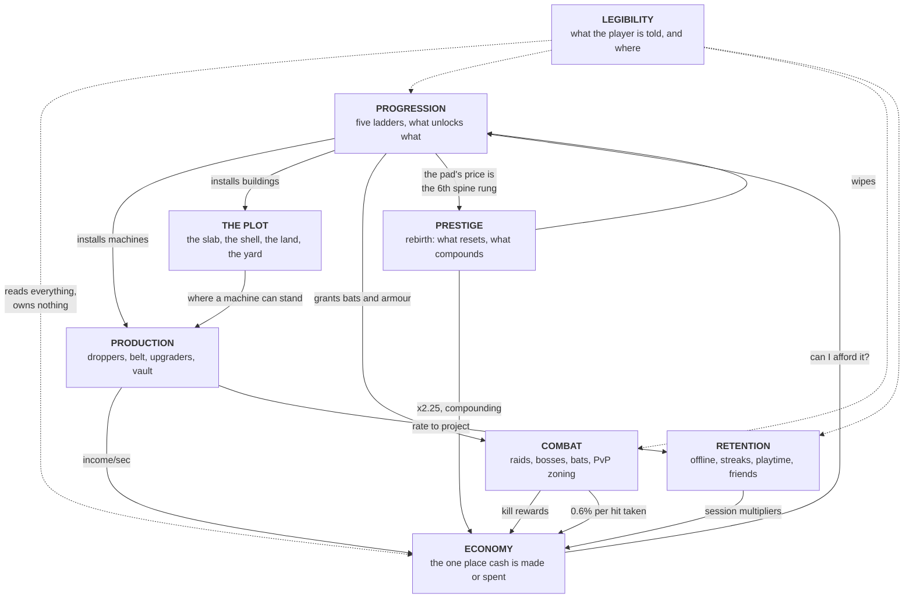

# The systems, and what each one owns

`GAME.md` is the flow a player walks. **This is the flow's parts** — the eight
systems the game is made of, what each is responsible for, what it may assume
about the others, and the seams where they touch.

**This is not the module map.** `../dev/ARCHITECTURE.md` is the module map:
every file in `src/`, who requires it, and what it must not do. A system here is
usually several modules, and one module occasionally serves two systems. When
you want to know *where the code is*, go there. When you want to know *what the
game is made of*, stay here.

---

## The map

Read the solid arrows as "produces a value the other consumes". The dotted ones
are the point of the last system: **legibility owns nothing and may change
nothing.** If a panel needs a number that does not exist yet, the number belongs
to whichever system it describes.

---

## 1. Production — the line

**Owns:** what a drop is worth, how often one appears, how it moves, and what
happens when it reaches the end.

The whole system is one identity, stated once in `GAME.md` §3 and implemented
three times deliberately: on the live plot, in the offline mirror, and in the
pacing simulation. **Those three must agree.** They are not a duplication to be
refactored away — each runs in a place the others cannot reach — but a change to
one is a change to three.

**Assumes of the plot:** that there is a belt with two legs, and that every
upgrader slot is downstream of every dropper slot. That guarantee is
*geometric*, not enforced by a rule at purchase time, which is why moving the
belt is a bigger change than it looks.

**The hard edge:** 70 drops in flight per plot. Everything about the generator —
that it speeds the belt and the droppers *together* — exists because of this
number. A faster line with the same belt runs out of room and the income you
paid for evaporates.

**The deliberate non-lever:** belt speed does not affect income. It buys
headroom under the drop cap and nothing else.

---

## 2. Economy — the ledger

**Owns:** the player's balance, and the composed multiplier applied to every
payout.

**There is one place cash is created and one place it is spent.** Everything
else asks. That is why the multiplier is a registry of *named* contributions
that compose — rebirths × friends × session boost × weekend — rather than a
number several systems each write to. A boost on a Saturday must come out ×4,
and two systems both "setting the multiplier" is how it comes out ×2.

**Assumes of everyone:** that a payout says whether the multiplier applies to
it. Raid rewards do. Offline grants apply a deliberately *narrower* stack — see
§7.

**Seam worth knowing:** a purchase pushes the new balance synchronously, while
income pushes on a beat. A purchase that takes a tenth of a second to show up
reads as a purchase that did not happen.

---

## 3. Progression — the ladders

**Owns:** what exists to be bought, in what order, and what each rung does.

Five ladders, each a strict chain against itself. **No requirement crosses a
ladder** — that is a property of how the chain is derived, not a promise
somebody keeps. The two cross-ladder relationships that do exist are separate
mechanisms on purpose:

| | scope | sticky across rebirth | how many today |
| --- | --- | --- | --- |
| `TrackUnlock` | a whole ladder waits | yes | 3 |
| `ButtonUnlock` | one purchase waits | no | **1**, and it should stay that way |

**Assumes of the plot:** that every rung has somewhere to stand. A ladder
declares where its buttons live — along the belt, in a column on the open floor,
in a cabinet aisle, or in the yard — and a rung with no home fails at build
time, loudly.

**Owns the pacing contract, jointly with the verifier.** Progression is where
the design decisions concentrate: which ladder is on the spine, how deep a
preview goes, what a detour may cost. Those are all `D-03` and `D-03`, and the
numbers are asserted rather than trusted.

**Seam worth knowing:** ladder *order* decides what the beacon and the status
card point at. Reordering the list is a gameplay change wearing a data change's
clothes.

---

## 4. Prestige — the reset

**Owns:** the boundary. What a rebirth destroys, what it keeps, and what the
multiplier is worth.

The rule is one line: **a ladder survives a rebirth exactly when it is a cabinet
ladder.** Weapons and armour are monotone grants to the *character* — a bat in
your hand, health you have. Everything else is plot machinery, and the plot is
what gets wiped. The generator is the case that makes the rule feel arbitrary
and is the reason it is a rule: it multiplies exactly what a rebirth resets.

**Assumes of progression:** that the spine's prices exist before the pad is
priced. The pad is not a constant — it costs whatever the sixth most expensive
spine rung costs, so that five rungs are provably still unbought when it lights
up.

**Known broken:** rebirths 4–12. See `D-03`.

---

## 5. Combat — the raid

**Owns:** the wave schedule, raider behaviour, the boss, damage, and who may hit
whom.

**Combat is the pitch and the economy is the game.** Everything in this system's
design is about keeping that true in both directions: raids are *worth* fighting
(kill rewards run through your full multiplier) and *safe* to fight (dying costs
nothing, and your factory keeps running while you are away from it).

**The one coupling to the economy that goes the wrong way** is `StealPerHit` —
0.6% of your bank per hit taken. It is the only economic penalty in the game and
it is deliberately small, because a tycoon that punishes you for fighting has
told you not to fight.

**Assumes of the plot:** that plots are outside the leash radius. Raiders cannot
reach a factory; that is arithmetic between two numbers and is asserted.

**Assumes of progression:** that bat tiers are monotone. A later tier is
strictly better, so granting one can never be a downgrade, which is what lets
the grant be idempotent and survive a rebirth.

**Seam worth knowing:** the boss is a *shared* objective — the pot splits across
contributors — while every other raider pays whoever killed it. That is the only
place in the game where two players' outcomes are coupled.

---

## 6. The plot — the building

**Owns:** the ground, the shell, the land it grows into, the yard, and where
anything is allowed to stand.

This system is mostly geometry, and its design content is about **what a plot
looks like before you have bought much of it.** Three decisions in a row came
from that: the cabinets moved off the claim and onto a gate, the yard shrank
from 4,320 square studs of concrete to a corner, and the generator previews
nothing because all four of its rungs resolve to one pad.

**The shell is a building sold in instalments**, not four interchangeable tiers.
Walls arrive solid and closed so that "Plot Walls" actually keeps a raider out;
windows are a material change to parts that already exist; the roof is last
because it derives its columns from the walls.

**Growth is outward now** (#88): land is bought in alternating strips, the
walls and roof follow it, and the centre pad stays the anchor. What stands on
new ground is #109's decision; the second storey this replaced is in the
handoff chain.

**Assumes of production:** the belt's shape. Assumes of progression: that a
building rung is declinable, which is new and is why the roof had to become a
gate.

---

## 7. Retention — the reasons to come back

**Owns:** everything that pays you for time rather than for play. Offline
earnings, the daily streak, the playtime ladder, the boost, the friend bonus.

**The design principle is that a reward you have not experienced does not
motivate you.** So the vault wears the offline number all session, before you
have ever been offline; the playtime ladder's first rung lands while you are
still deciding whether to stay; the invite button's zero state is the offer.

**Assumes of production:** a rate it can project. It reads a *saved profile*,
never a live plot, which is what lets it price a session that is not running.

**The deliberate narrowing:** the offline rate excludes the boost, the weekend
and the friend bonus. Those are properties of *being in a session*. Quoting a
boosted rate would promise a payout offline will never make.

**Assumes of the economy:** that its contributions compose by name rather than
overwrite.

---

## 8. Legibility — what the player is told

**Owns nothing. Reads everything.**

The system-level decision is that **most of this game's interface is in the
world**: buy pads, machine plates, cabinet signs, the plot totem, the vault
gauge, and the raid banner hung over the arena statue. Screen space is reserved
for the two things that are true no matter where you are standing — your balance
and your next purchase — plus the session panel and one rail.

Three constraints shape all of it:

1. **Four out of five sessions are a phone.** The bottom corners belong to the
   engine's thumbstick and jump button; anything docked there is a mis-tap.
2. **Colour alone is the first signal lost** to a bright sky. Available and
   locked differ in five properties at once — size, panel alpha, stroke, text
   alpha and view distance — not in hue.
3. **The card and the beacon must never disagree.** They rank candidates by the
   same rule and evaluate the same gates. Two surfaces naming different "next
   purchases" is worse than one surface naming none.

**Seam worth knowing, and it is the sharp one:** legibility duplicates
progression's ranking rule so that the client can render it without a round
trip. A change to what "next" means is a change in two places, and nothing
catches a divergence.

---

## Where design intent still lives in code

Being honest about the current state, since this tree is new. Three categories
that `docs/design/` does not yet own and arguably should:

- **All player-facing copy is a literal in the module that sends it** — every
  notification title and body, every button label. Only a purchase's `name` and
  `blurb` are data. Moving it is a real refactor and has not been done.
- **Machine silhouettes and the colour language are hardcoded** — the shape of a
  dropper, the plot palette, the UI palette. The verifier structurally cannot
  see any of it.
- **The pacing bands argue for themselves in the verifier's assertion
  messages.** The number is in `Config.lua`, the check is in
  `tools/verify_config.lua`, and the *reason* is in the message string. Those
  checks should cite their `D-NN` instead of restating the policy; that
  migration has not happened yet.
